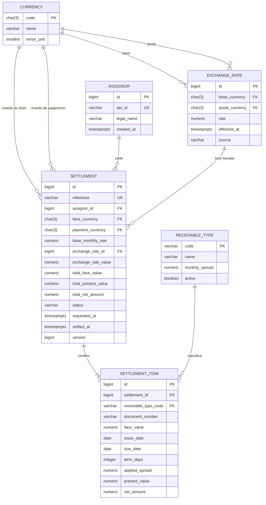

# Modelo de dados

O schema é versionado com Flyway em `backend/src/main/resources/db/migration`. O arquivo
[`schema.sql`](./schema.sql) traz o DDL consolidado, equivalente ao estado após aplicar todas as
migrations — útil para inspeção rápida, mas o Flyway é a fonte da verdade.

## Diagrama ER

## Decisões de modelagem

**Lote como agregado.** O desafio fala em "receber um lote de recebíveis". `SETTLEMENT` é o
cabeçalho da operação e `SETTLEMENT_ITEM` são os títulos do lote. Isso dá um limite natural de
transação: o lote inteiro é gravado e liquidado, ou nada é. A liquidação parcial deixa de ser
representável no banco em vez de depender só do código de aplicação.

**`NUMERIC`, nunca ponto flutuante.** Valores monetários usam `NUMERIC(18,2)` e taxas
`NUMERIC(9,6)`; a cotação usa `NUMERIC(18,8)` porque pares como BRL→USD precisam de mais casas
para não perder precisão no arredondamento final. `DOUBLE PRECISION` está fora de questão em
qualquer coluna financeira.

**Cotação travada por valor, não por referência.** `SETTLEMENT` guarda o `exchange_rate_id` **e** o
`exchange_rate_value`. A FK preserva a auditoria (de qual cotação veio), e a cópia do valor garante
que o extrato reproduza exatamente o câmbio aplicado na liquidação, mesmo que a linha de origem
mude. Cotação é histórico: `EXCHANGE_RATE` é append-only, com `effective_at` e unicidade por
par + momento, e a taxa vigente é a de `effective_at` mais recente.

**Spread copiado no item.** `applied_spread` é gravado em cada item mesmo existindo em
`RECEIVABLE_TYPE.monthly_spread`. A política de risco muda com o tempo; o que foi precificado
ontem tem que continuar explicável hoje.

**Invariantes no banco, além da aplicação.** As validações de input ficam na API, mas o schema
também sustenta as regras que não podem ser violadas por nenhum caminho de escrita:

| Constraint | Regra |
|---|---|
| `ck_settlement_cross_currency_rate` | operação cross-currency exige cotação registrada; operação mono-moeda proíbe |
| `ck_settlement_settled_at` | `settled_at` preenchido se e somente se o status é `SETTLED` |
| `ck_settlement_amounts` | totais estritamente positivos |
| `ck_settlement_item_dates` | vencimento posterior à emissão |
| `uq_settlement_item_document` | mesmo documento não entra duas vezes no lote |
| `uq_settlement_reference` | idempotência: reenvio do mesmo lote não duplica a operação |

**Status como `VARCHAR` + `CHECK`.** `PENDING`, `SETTLED`, `CANCELLED`. Preferi isso a `ENUM` nativo
do Postgres porque adicionar valor a um enum é DDL, enquanto aqui é só editar o `CHECK` numa
migration — e o mapeamento com `EnumType.STRING` no JPA fica direto.

**`version` para lock otimista.** A coluna existe para o `@Version` do JPA barrar duas liquidações
concorrentes do mesmo lote. Isso cobre a race condition citada no requisito 3 sem custo de lock
pessimista no caminho de leitura.

## Índices

Os índices seguem os filtros do extrato de liquidação (período, cedente, moeda):

- `ix_settlement_settled_at` — recorte por período, o filtro sempre presente.
- `ix_settlement_assignor_settled_at` — cedente + período.
- `ix_settlement_payment_currency_settled_at` — moeda de pagamento + período.
- `ix_settlement_item_settlement` — join do cabeçalho com os itens.
- `ix_exchange_rate_lookup` — busca da cotação vigente de um par (`effective_at DESC`).

Os compostos deixam `settled_at` como segunda coluna de propósito: o padrão de consulta é sempre
um valor exato para a primeira coluna e uma faixa para a data, que é onde um índice B-tree composto
rende melhor.

## Dados de referência

A migration `V3` popula moedas (BRL, USD), tipos de recebível com os spreads do enunciado
(duplicata 1,5% a.m., cheque pré-datado 2,5% a.m.), cotações iniciais USD↔BRL e dois cedentes de
exemplo. É seed de referência, não massa de teste: a aplicação não sobe funcional sem essas linhas.
